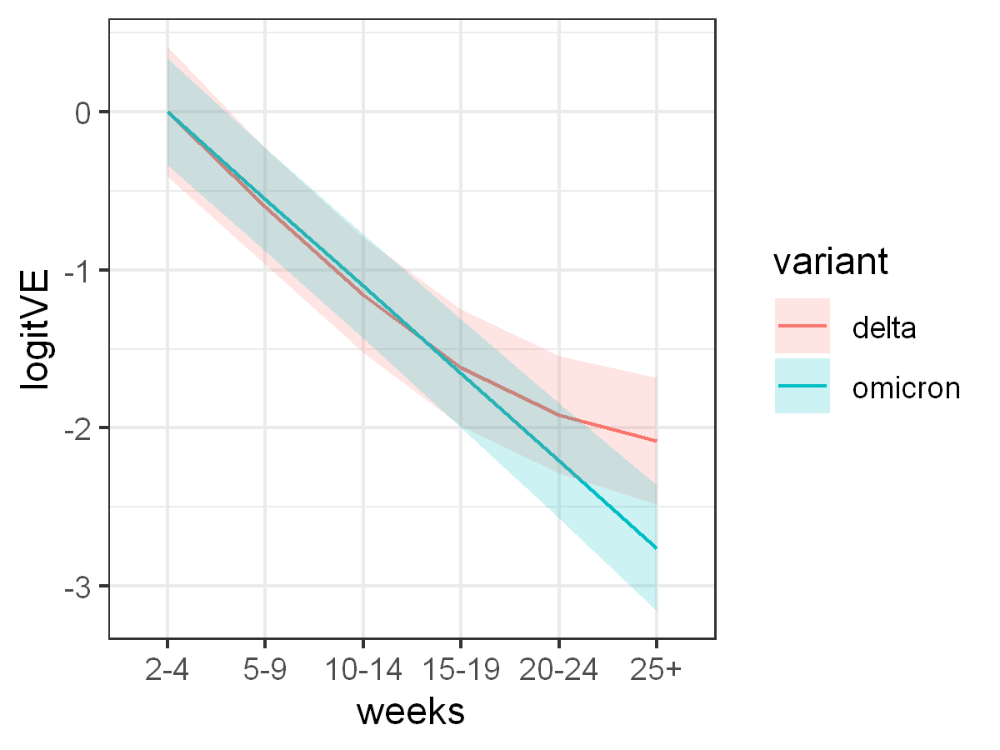

# Comparison of vaccine efficacy waning trends over time for Omicron vs Delta using UHKSA estimates
Mike Famulare

[Institute for Disease Modeling](www.idmod.org) | Global Health | Bill \& Melinda Gates Foundation

4 February 2022

## Summary

Here, I take a look at how the trend of waning vaccine efficacy over time in data from UKHSA differs between Omicron and Delta. 
With estimates of vaccine efficacy against symptomatic disease grabbed from [UKHSA COVID-19 vaccine surveillance report -- Week 4 -- 27 Jan 2022](https://assets.publishing.service.gov.uk/government/uploads/system/uploads/attachment_data/file/1050721/Vaccine-surveillance-report-week-4.pdf), I used mixed-effects beta-regression modeling with logit link to isolate the shared trend over time from the differences in baseline protection level across various vaccine combinations. The isolated temporal trends indicate that waning of protection against symptomatic disease occurs at similar rates for omicron and delta during the first 19 weeks post-vaccination. In weeks 20-24 and 25+ after vaccination, the trends for delta and omicron diverge, with delta efficacy remaining more stable as omicron efficacy continues to fall exponentially toward zero. While this difference is only supported by VE estimates for people with two-dose vaccination because post-booster data at that time interval is not yet available, this data suggests that protection from symptomatic disease following WT vaccination is less stable for Omicron than for Delta and likely other variants more antigenically similar to WT.  

The observation that efficacy against symptomatic disease following WT vaccination is less stable for omicron is consistent with evidence from neutralization studies in boosted populations. For example, [Pajon et al 2022](https://t.co/lBxMqBjWpL) and [Zhao et al 2022](https://t.co/mswdI6Lqxk)) show that neutralizing antibody titers following WT vaccination wane further for omicron four to six months after booster dose than do titers against variants that are more antigenically similar to WT. 

Taken together, it is plausible that repeated WT vaccination will not be capable of producing stable protection against symptomatic disease for omicron(-like) variants more than 3-4 months post-vaccination.  Thus, omicron-specific (or omicron-descendant) vaccines may be necessary to stimulate more durable immunity against epitopes not present in WT even if WT vaccine offers similar protection shortly after vaccination. 

## Data and Analysis

Estimates of vaccine efficacy against symptomatic disease were grabbed from [UKHSA COVID-19 vaccine surveillance report -- Week 4 -- 27 Jan 2022](https://assets.publishing.service.gov.uk/government/uploads/system/uploads/attachment_data/file/1050721/Vaccine-surveillance-report-week-4.pdf) using [Automeris Web Plot Digitizer](https://automeris.io/WebPlotDigitizer/) and is available at [UKHSA-VE-grab.csv](UKHSA-VE-grab.csv).

To model the waning trends for omicron and delta efficacy as a function of weeks since last vaccination, starting from weeks 2-4, I used mixed-effects beta regression with logit link using the [mcgv](https://rdrr.io/cran/mgcv/) package in R. Beta regression is appropriate to model outcomes on a (0,1) scale. The outcome was vaccine efficacy and the covariates (weeks since last vaccination), variant (omicron or delta), and vaccine schedule (mix of AZ, Pfizer, and Moderna in 2 and 3 dose schedules). The differences in protection level among the various vaccines were modeled as random intercepts. After performing model selection among linear/no-interaction, linear/weeks-variant interaction, and non-linear/weeks-variant interaction models, I found that the best fitting model was the nonlinear interaction model. (See [UKHSA-VE-grab.R](UKHSA-VE-grab.R) for full model specification and workflow.)

The model results shown in the figures below represent the prediction and 95\% empirical bayesian credible interval for efficacy vs weeks since vaccition for the "modal vaccine" (an archetypal vaccine with the random intercept equal to zero). 

Everything necessary to reproduce the main analysis is available at [Github/famulare/UKHSA-omicron-delta-waning-trends](https://github.com/famulare/UKHSA-omicron-delta-waning-trends)

## Figures

Figure 1. Vaccine efficacy estimates for various vaccine combos and omicron and delta variants. Colored dots and lines are directly captured from [UKHSA COVID-19 vaccine surveillance report -- Week 4 -- 27 Jan 2022](https://assets.publishing.service.gov.uk/government/uploads/system/uploads/attachment_data/file/1050721/Vaccine-surveillance-report-week-4.pdf) using [Automeris Web Plot Digitizer](https://automeris.io/WebPlotDigitizer/). Dashed black line and gray ribbon shows best fit and 95\% empirical bayesian credible interval for the modal vaccine under the model.

Figure 2. Logit of vaccine efficacy estimates shown in Figure 1. The logit transform linearizes vaccine efficacy estimates and is also proportional to the mechanistic relationship between vaccine efficacy and log neutralizing antibody titers, as shown by [Khoury et al 2021](https://www.nature.com/articles/s41591-021-01377-8) and others.

Figure 3. This shows the isolated time trends on the logit scale for delta and omicron. Through 19 weeks, the waning trends are essentially identical. From weeks 20-24 on, delta waning appears to slow down while omicron waning continues to fall linearly in logit space (and thus exponentially in vaccine efficacy). 

## Comment on relationship between logit vaccine efficacy and neutralizating antibody titers

