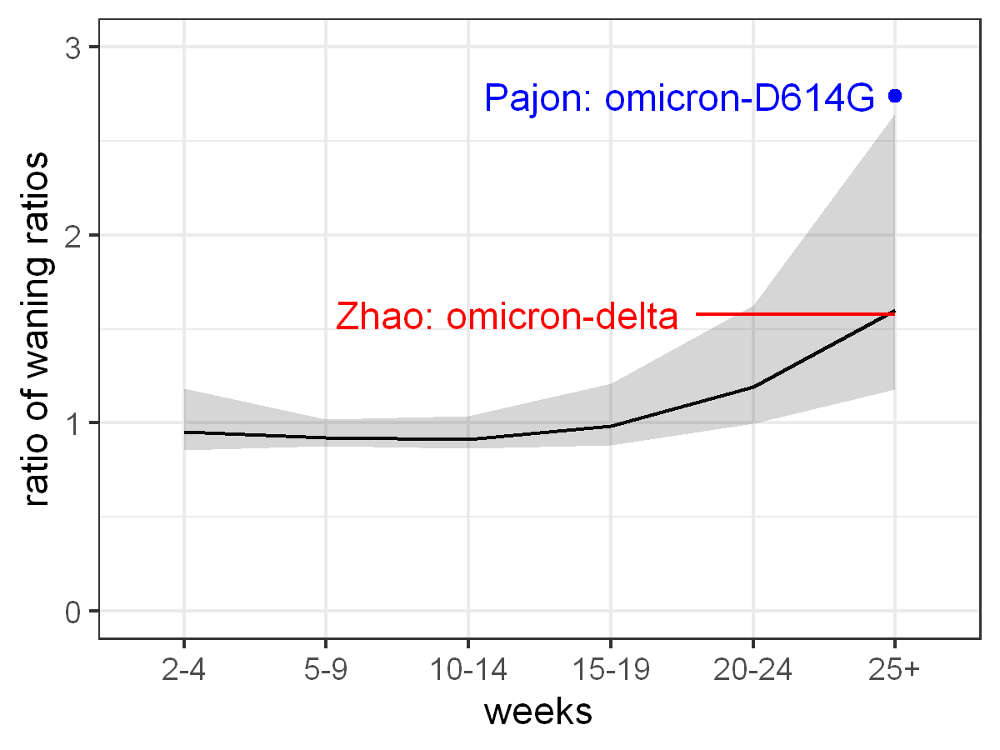

# Comparison of vaccine efficacy waning trends over time for omicron vs delta using UHKSA estimates
Mike Famulare

[Institute for Disease Modeling](www.idmod.org) | Global Health | Bill \& Melinda Gates Foundation

16 February 2022

## Summary

Here, I take a look at how the trend of waning vaccine efficacy over time in data from UKHSA differs between omicron and delta, and show that it is consistent with limited data on neutralizing antibody titer data. Taken together, I think we are seeing evidence that serologic immunity to omicron from wild-type (WA1, early-2020-era SARS-CoV-2) vaccination is less stable than against delta (and likely other variants less distantly related to WA1 than omicron).

With estimates of vaccine efficacy against symptomatic disease grabbed from [UKHSA COVID-19 vaccine surveillance report -- Week 4 -- 27 Jan 2022](https://assets.publishing.service.gov.uk/government/uploads/system/uploads/attachment_data/file/1050721/Vaccine-surveillance-report-week-4.pdf), I used mixed-effects beta-regression modeling with logit link to isolate the shared trend over time from the differences in baseline protection level across various vaccine combinations. The isolated temporal trends indicate that waning of protection against symptomatic disease occurs at similar rates for omicron and delta during the first 19 weeks post-vaccination. In weeks 20-24 and 25+ after vaccination, the trends for delta and omicron diverge, with delta efficacy remaining more stable as omicron efficacy continues to fall exponentially toward zero. While this difference is only supported by VE estimates for people with two-dose vaccination because post-booster data at that time interval is not yet available, this data suggests that protection from symptomatic disease following WA1 vaccination is less stable for omicron than for delta and likely other variants more antigenically similar to WA1.  

The observation that efficacy against symptomatic disease following WA1 vaccination is less stable for omicron is consistent with evidence from neutralization studies in boosted populations. For example, [Zhao et al 2022](https://t.co/mswdI6Lqxk) shows that neutralizing antibody titers following WA1 vaccination wane further for omicron four to six months after booster dose than do titers against variants that are more antigenically similar to WA1. [Pajon et al 2022](https://t.co/lBxMqBjWpL) provide similar data showing the same after boosters for D614G and omicron.  I use the logit-linear relationship between vaccine efficacy and neutralizing antibody titers first demonstrated in [Khoury et al 2021](https://www.nature.com/articles/s41591-021-01377-8) to show that the observed difference in UKHSA vaccine efficacy waning is consistent with the observed differences in both neutralization studies. 

Taken together, it is plausible that repeated WA1 vaccination will not be capable of producing stable protection against symptomatic disease for omicron(-like) variants more than 3-4 months post-vaccination.  Thus, omicron-specific (or omicron-descendant) vaccines will be necessary to stimulate more durable immunity, even if WA1 vaccine offers similar protection shortly after vaccination. 

## Analysis

Everything necessary to reproduce this analysis is available at [Github/famulare/UKHSA-omicron-delta-waning-trends](https://github.com/famulare/UKHSA-omicron-delta-waning-trends).

Estimates of vaccine efficacy (VE) against symptomatic disease were grabbed from [UKHSA COVID-19 vaccine surveillance report -- Week 4 -- 27 Jan 2022](https://assets.publishing.service.gov.uk/government/uploads/system/uploads/attachment_data/file/1050721/Vaccine-surveillance-report-week-4.pdf) using [Automeris Web Plot Digitizer](https://automeris.io/WebPlotDigitizer/) and are available at [UKHSA-VE-grab.csv](UKHSA-VE-grab.csv).

To model the waning trends for omicron and delta efficacy as a function of weeks since last vaccination, starting from weeks 2-4, I used mixed-effects beta regression with logit link with the [mcgv](https://rdrr.io/cran/mgcv/) package in R. Beta regression is appropriate to model outcomes on a (0,1) scale. The outcome was vaccine efficacy and the covariates (weeks since last vaccination), variant (omicron or delta), and vaccine schedule (mix of AZ/ChAdOx1-S, Pfizer/BNT162b2, and Moderna/mRNA-1273 in 2 and 3 dose schedules). The differences in protection level among the various vaccines were modeled as random intercepts. After performing model selection among linear/no-interaction, linear/weeks-variant interaction, and non-linear/weeks-variant interaction models, I found that the best fitting model was the nonlinear interaction model. (See [UKHSA-VE-grab.R](UKHSA-VE-grab.R) for full model specification and workflow.) The model results shown in the figures below represent the prediction and 95\% empirical Bayesian credible interval for efficacy vs weeks since vaccination for the "modal vaccine" (an archetypal vaccine with the random intercept equal to zero, and which so happens to be roughly equivalent to two primary Moderna doses). 

**Figure 1.** Vaccine efficacy estimates for various vaccine combos and omicron and delta variants. Colored dots and lines are directly captured from [UKHSA COVID-19 vaccine surveillance report -- Week 4 -- 27 Jan 2022](https://assets.publishing.service.gov.uk/government/uploads/system/uploads/attachment_data/file/1050721/Vaccine-surveillance-report-week-4.pdf) using [Automeris Web Plot Digitizer](https://automeris.io/WebPlotDigitizer/). Dashed black line and gray ribbon shows best fit and 95\% empirical bayesian credible interval for the modal vaccine under the model.

**Figure 2.** Logit of vaccine efficacy estimates shown in Figure 1. The logit transform linearizes vaccine efficacy estimates and is also proportional to the mechanistic relationship between vaccine efficacy and log neutralizing antibody titers, as shown by [Khoury et al 2021](https://www.nature.com/articles/s41591-021-01377-8) and others.

Using the model, we can isolate the waning trend from the difference in intercept between the variants. Below, we see that the waning trends are very similar through 19 weeks, but diverge thereafter. VE for omicron continues to fall linearly in logit space while the waning rate for delta slows down. If this pattern reflects biology and isn't just an artifact of some uncorrected confounding, then we are seeing evidence that immunity against omicron (and omicron-like variants) from the WA1-based vaccines currently in use will be less stable than for delta. 

**Figure 3.** This shows the isolated time trends on the logit scale for delta and omicron. Through 19 weeks, the waning trends are essentially identical. From weeks 20-24 on, delta waning appears to slow down while omicron waning continues to fall linearly in logit space (and thus exponentially in vaccine efficacy). 

To bring in immune correlate data from boosted populations and independently verify that the difference in waning rates estimate above is consistent with immunological evidence and in boosted populations, I modeled the relationship between efficacy and antibody titer using the logit-linear relationship first demonstrated in [Khoury et al 2021](https://www.nature.com/articles/s41591-021-01377-8). With some arithmetic, one can derive a one-parameter prediction for the relative difference in NAb waning between omicron and delta from the observed VE difference. 

Starting with the fundamental relationship,
 
one can derive a difference-in-difference prediction of the expected ratio of waning ratios from 1 to M months after vaccination using only the time trends of VE and one free parameter:

The beta parameter is estimated in [Khoury et al 2021](https://www.nature.com/articles/s41591-021-01377-8) Table S5, and, in our model on the natural log scale, has mean 3/log(10)=1.3 and 95\% confidence interval (2.2/log(10)=0.96, 4.2/log(10)=1.8). (In the appendix, we derive a parameter-free estimator that is entirely self-contained, but which is less statistically efficient, and show results.)

When this ratio of titers, which depends only on differences within variant and not across variants, is greater than 1, it indicates that omicron is waning at a faster rate than delta over the time interval. 

This prediction for the ratio of antibody titer waning ratios is compared to data from two relevant papers. [Zhao et al 2022](https://t.co/mswdI6Lqxk)) look how titers from Zifivax (a subunit vaccine in trials in China) after a booster schedule (second dose 1 month after first, third dose 4 months after second) taken 1 month after booster and 4-6 months after booster compare for delta and omicron.  Median delta titers go from 2133 at 1 month to 516 at 4-6 months, and omicron from 331 to 51.  The ratio of waning ratio is thus (2133/516)/(331/51) = 1.58. This ratio tells us that, in the point estimate, omicron titers are waning at a faster rate than delta titers over that time interval. Similarly, from [Pajon et al 2022](https://t.co/lBxMqBjWpL), we can calculate an upper bound for this ratio for the Moderna vaccine by comparing titers for WA1-D614G and omicron 1 and 6 months post-boost. The ratio of reported waning ratios for omicron over delta is 6.3/2.3=2.74. (Pajon et al also include data after two doses but censoring at low titers and the many sample showing no neutralizing activity preclude valid analysis.)  In Figure 4, we show that the Zhao estimate overlaps the predictions from VE in the time period studied, and the Pajon estimate is a reasonable upper bound.

**Figure 4.** Ratio of waning ratios for omicron relative to delta. Line and ribbon are predicted from the difference in waning trends from UKHSA efficacy estimates, with slope parameter from Khoury et al. Red line shows the ratio of medians for Zifivax evaluated from 1 to 4-6 months post-booster. Blue shows the upper bound for the Moderna vaccine comparing omicron to D614G.  

Although the total amount of data going into this analysis is much smaller than I would like, I think that **concordance between these two very different types of evidence indicates that the VE waning is primarily biological and not due to confounding, and that differences in NAb waning that may not seem significant in any one study are epidemiologically meaningful.** 

## Conclusion

Early data on vaccine efficacy and neutralizing antibody titers indicate that serologic protection against omicron (and omicron-like variants) from our current WA1-based vaccines is less stable than protection against delta, and that this difference only begins to manifest four months after the most recent vaccination. The very limited data are consistent with similar waning rate differences after two primary doses and boosters.  **Thus, it will be important to consider longer-term immune response when discussing updates to vaccine strains. It is not sufficient to only look at antibody titers one month after the most recent vaccination, as differences in durability will not be seen.** 

There is conflicting data on the effect of omicron immunization from vaccines and breakthrough infection that may make sense together when considering maturation after omicron exposure and which specific antigens are present to recall memory immunity. 
[Gagne et al](https://www.biorxiv.org/content/10.1101/2022.02.03.479037v1.full) report that in non-human primates, re-vaccination with an omicron-variant Moderna vaccine provokes similar (slightly inferior) antibody and memory b-cell responses against all variants including omicron than boosting with WA1 vaccine, when measured 14 days after the most recent vaccination. Similar results were found with a beta-variant vaccine in humans [Choi et al](https://www.nature.com/articles/s41591-021-01527-y).
In contrast, from sera collected 14-55 days after breakthrough infection, [Gaebler et al](https://www.medrxiv.org/content/10.1101/2022.02.09.22270692v1.full-text) show that breakthrough with omicron after two and three dose vaccination boosts antibody titers against omicron and delta to similar levels --- comparable to the boosting of delta titers by delta breakthrough --- while delta breakthrough infection does not boost omicron antibody titers as effectively. While the difference may be due to immunizing differences between infection vs vaccination, or differences in neutralization assay, the pattern across these studies is consistent with possible maturation of protection against omicron post omicron infection. Furthermore, [Pfizer/BioNTech have reported (but not yet published)](https://twitter.com/whippletom/status/1468584962622468107) that other variant spike vaccines provoke different responses against omicron, with an alpha-variant vaccine producing the best short-term boost. This indicates that tuning the antigenic repertoire of future boosters can produce superior responses over time. 
Furthermore, [Regev-Yochay et al](https://www.medrxiv.org/content/10.1101/2022.02.15.22270948v1.full.pdf) report that the additional efficacy of a fourth dose of WT vaccine given 4+ months after the third is very low. This was observed in a population selected for low pre-dose titers and thus maximally likely to show a benefit.

Overall, the early evidence indicates that immunity against omicron from WA1 vaccination is less durable, that responses following an omicron immunizing event likely mature with time, and that omicron-like responses can be improved more effectively by antigenic exposures not in the current vaccines. Researchers need to be meauring immune response over time post boosters and must not write off the impact of variant-specific vaccines based only on immune response in the first few weeks after vaccination. 

Given that the world is on pace to be producing 1 billion vaccines a month (source: [IFPMA](https://www.ifpma.org/resource-centre/momentum-of-covid-19-vaccine-manufacturing-production-scale-up-is-now-sufficient-for-step-change-in-distribution-and-opens-way-for-urgent-political-leadership-and-country-preparedness/)), **it is past time to figure out how to update the vaccines.** 
 
 
### Appendix: parameter-free efficacy to titer mapping

As above, starting with the fundamental relationship, logit(VE) \sim log(NAb) one can derive a difference-in-difference prediction of the expected ratio of waning ratios from 1 to M months after vaccination using only the time trends of VE and zero free parameters:

As above, when this ratio of log-titers, which depends only on differences within variant and not across variants, is greater than 1, it indicates that omicron is waning at a faster rate than delta over the time interval. 

As shown in the figure below, we find the same qualitative results with this analysis as the previous one, but the uncertainty is higher. This is because this estimator is less efficient as it depends on ratios instead of differences. I've included it here for readers who may not prefer the additonal modeling assumption used above. 

This prediction for the ratio of the log differences antibody titer due to waning is compared to data from two relevant papers. [Zhao et al 2022](https://t.co/mswdI6Lqxk)) look how titers from Zifivax (a subunit vaccine in trials in China) after a booster schedule (second dose 1 month after first, third dose 4 months after second) taken 1 month after booster and 4-6 months after booster compare for delta and omicron.  Median delta titers go from 2133 at 1 month to 331 at 4-6 months, and omicron from 516 to 51.  The ratio of waning log differences is thus (log(516)-log(51))/(log(2133)-log(331)) = 1.24. This ratio tells us that, in the point estimate, omicron titers are waning at a faster rate than delta titers over that time interval. Similarly, from [Pajon et al 2022](https://t.co/lBxMqBjWpL), we can calculate an upper bound for this ratio for the Moderna vaccine by comparing titers for D614G and omicron 1 and 6 months post-boost. Median D614G titers after booster go from 2423 at 1 month to 1067 at 6 months, and omicron from 850 to 136.  The ratio of waning log differences is thus 2.23. (Due to censoring at low titers, we cannot do this for the 2-dose data.) In Figure 5, we show that the Zhao estimate overlaps the predictions from VE in the time period studied, and the Pajon estimate is higher. Consistent with the prior analysis, these show that direct measurements of Omicron-delta antibody waning are consistent with estimates derived from vaccine efficacy, and that the further the variant studied is from WA1, the larger the waning difference over time. 

**Figure 5.** Ratio of log titer waning differences for omicron relative to delta. Line and ribbon are predicted from the difference in waning trends from UKHSA efficacy estimates with zero free parameters. Red line shows the log difference ratio of GMTs for Zifivax evaluated from 1 to 4-6 months post-booster. Blue shows the upper bound for the Moderna vaccine comparing omicron to D614G.  
